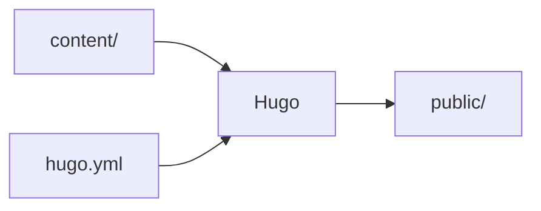
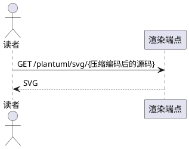

# 图表、媒体与引用组件

来源：https://oink.pgsty.com/zh/docs/components/（OINK v1.2.0 文档）

覆盖公式、图表运行时（Mermaid / PlantUML / Markmap / Draw.io / ECharts / Infographic）、画廊，以及引用类 shortcode（include / param / comment）与 Asciinema 终端录像。

共同原则：组件是围栏或 shortcode；运行时随主题分发、不连 CDN；用到该组件的页面才加载运行时；打印 / Markdown / RSS 三种输出给静态降级，图上的结论必须在正文里写一遍。

## 公式（math / chem / eq）

用 KaTeX 在**构建期**渲染成 HTML + MathML，页面只额外加载一份本地 `katex.min.css`，无 JavaScript，不请求远程服务。需要 TikZ 或 KaTeX 不支持的宏包时改用预渲染图片。

### 最短语法

```markdown
行内：共享缓冲区命中率 \( \mathrm{hit} = \frac{H}{H + R} \)。

块级（`\[…\]` 等价）：$$
h = \left\lceil \log_{f} N \right\rceil
$$
```

不依赖 passthrough 的围栏 ```` ```math ````、```` ```chem ````（后者正文写 `\ce{…}`）。

编号公式：块级公式下跟一行属性即编号，`num` 手写、主题不自动计数，`#id` 省略默认 `eq-<num>`，`#id` 与 `caption` 必须与 `num` 同时出现：

```markdown
$$
\text{WAL}_{\text{day}} \approx \text{TPS} \times \bar{s}_{\text{record}} \times 86400
$$
{#eq-wal num="3-1" caption="每日 WAL 产量的估算"}

见[公式 3-1](#eq-wal)，或 （可前向引用）。
```

`eq` shortcode 供无法开启 passthrough 的站点使用，不带 `num` 即普通块级公式。

### 写法对照

| 写法 | 位置 | 说明 |
| --- | --- | --- |
| `\(…\)` | 行内 | 由站点 passthrough 决定；不能带属性 |
| `$$…$$` / `\[…\]` | 块级 | 同上；可跟属性行编号 |
| ```` ```math ```` | 块级围栏 | 不依赖 passthrough；不接受属性 |
| ```` ```chem ```` | 块级围栏 | 同上，正文写 `\ce{…}` |

### 参数

编号属性行 `{…}`：`num`（字符串，`[0-9A-Za-z.-]+`，注册编号）、`#id`（标识符，默认 `eq-<num>`，锚点与交叉引用目标）、`caption`（纯文本，需 `num`）。

`eq` shortcode：`num`（字符串）、`id`（标识符，默认 `eq-<num>`，需 `num`）、`caption`（纯文本，需 `num`）、`class`（class 列表，需 `num`）、正文（TeX，必填非空）。

### 前置配置

`math` / `chem` 围栏无需配置。`$$`、`\[…\]`、`\(…\)` 依赖 Goldmark passthrough；Hugo **不合并**主题的 `markup` 配置，必须写在站点配置文件：

```yaml
markup:
  goldmark:
    parser:
      attribute:
        block: true # 编号公式的属性行需要它
    extensions:
      passthrough:
        enable: true
        delimiters:
          block: [['\[', '\]'], ['$$', '$$']]
          inline: [['\(', '\)']]
```

单个 `$` 没配进去，避免「$5」被当成公式。

### 降级

| 输出 | 呈现 |
| --- | --- |
| HTML | KaTeX HTML + MathML；本页额外加载本地 `katex.min.css`，无公式页不加载 |
| 打印 | 同 HTML，静态，长公式不滚动 |
| Markdown | 原样源码：`$$` 块（连属性行）、`math`/`chem` 围栏、`\(…\)`；`eq` 输出 `**公式 3-2.** 说明` + `$$` 块 |
| RSS | 与 Markdown 相同的静态文本 |

任何形态都不加载 JavaScript。

### 常见坑

- front matter 写 `math: true` 主题不读；缺 passthrough 配置时 `$$` 原样显示，改用 `math` 围栏或 `eq` 绕开。
- 只有 `$$` 块和 `eq` 能编号；编号手写，调整章节顺序要自己改 `num`。
- 行内公式不能带属性；`caption` 是纯文本，Markdown 不解析。
- TeX 写错时普通预览告警并保留原表达式，严格发布构建拒绝该警告。

## Mermaid

用 `mermaid` 围栏把文本写成流程图、时序图、甘特图、类图、ER 图与状态图。源码进 Git、可 review diff、可搜索；渲染由主题自带的 Mermaid 在读者浏览器完成，不请求外部服务。

### 最短语法

````markdown

````

围栏语言写 `mermaid` 即可，检测到围栏后才把运行时加入该页，同页多图只加载一次。图类型：`sequenceDiagram`、`gantt`、`classDiagram` / `erDiagram`、`stateDiagram-v2`。

单张图的配置写在围栏正文最前面的 YAML 头（**不是** Hugo front matter），`title` 加标题、`config` 覆盖这一张图的配置；写死 `config.theme` 后不再跟随深浅色。

### 站点参数（`hugo.yml`）

| 参数 | 类型 | 默认 | 说明 |
| --- | --- | --- | --- |
| `params.mermaid` | map | 未设置 | 整个映射按 Mermaid `initialize()` 传入；键名写小写，主题按 Mermaid 默认配置匹配回正确大小写 |
| `params.mermaid.theme` | string | Mermaid 默认 | 浅色模式下的主题；深色模式强制 `dark` |

```yaml
params:
  mermaid:
    theme: neutral
    flowchart:
      diagrampadding: 6
```

深浅色：初始化时读当前配色，切换时就地重绘且保持高度不跳动，因此不要放进需保留输入状态的页面（如带表单的页面）。比栏宽的图会被缩小，悬停/聚焦出现按钮，点击按原始尺寸重渲染，可平移（拖动）、缩放（滚轮/双指/`+` `-`）、`0` 复位、`Esc` 关闭。

### 降级

| 输出 | 呈现 |
| --- | --- |
| HTML | 一个 `figure`，空舞台 + 以 JSON 保存的围栏源码，运行时把 SVG 画进去 |
| 打印 | `<pre class="td-mermaid-source">` 包着的源码，静态，不跑运行时 |
| Markdown | 原样保留围栏与源码 |
| RSS | `<pre class="td-mermaid-source">` 包着的源码 |

### 常见坑

- 围栏属性无效：不读属性行，`{height=…}`、`{class=…}` 既不生效也不报错；图总居中。
- 图不能编号：输出内联 SVG 而非 ``，`{#id num=}` 不适用。
- 语法错误只在浏览器可见：Hugo 不解析 Mermaid 语法，写错只显示带解析错误与源码的提示，构建照过。
- 没有 `tab` 属性；并排比较用 `tabs` shortcode，`{}` 里可以写 `mermaid` 围栏。

## PlantUML

用 `plantuml` 围栏写时序图、类图、组件图、活动图与用例图。渲染**必须由站点自行配置 PlantUML 服务**，主题不提供默认端点。

> [!WARNING] 当前主题版本的 `plantuml` 围栏对 `<`、`>`、`&`、`"` 二次转义，带箭头或引号的源码送到端点后返回 `Syntax Error?` 图。带箭头字符的图（时序、类、组件、用例、状态）目前渲染不出来，只有活动图这类不含这些字符的图可正常渲染。修复前改用 Mermaid 或预渲染图片。

> [!IMPORTANT] 编码后的图表源码作为 URL 发给端点，会离开浏览器；不要在图中写口令、内网主机名或客户名称。

### 最短语法

````markdown

````

其余形态：`class` 写成员、`"1" -- "0..*"` 写基数；`package "名字" { … }` 圈部署单元；`start`/`stop` 加 `if … then … else … endif` 画分支；`actor` / `(用例)` / `rectangle` 画用例图。深色模式用 `skinparam`（`backgroundColor transparent`、`defaultFontName`、`ArrowColor` 等）自行调色；`!theme` 指令也可用，主题包由服务端提供。

### 站点参数（`hugo.yml`）

| 参数 | 类型 | 默认 | 说明 |
| --- | --- | --- | --- |
| `params.plantuml.enable` | bool | `false` | 关闭时围栏保持代码块，不加载运行时 |
| `params.plantuml.svg_image_url` | string | 无 | 渲染端点，编码后源码直接拼在其后；`enable: true` 时必填，否则告警并保持关闭 |
| `params.plantuml.svg` | bool | `false` | `false` 插 ``；`true` 插 `<svg data-src>` 并额外加载外部 SVG 加载器 |

```yaml
params:
  plantuml:
    enable: true
    svg_image_url: https://plantuml.internal.example/plantuml/svg/
    svg: false
```

- `enable: true` 却没写 `svg_image_url` → 构建报错 `params.plantuml.enable requires an explicit params.plantuml.svg_image_url`。
- 自建可用官方镜像 `plantuml/plantuml-server`，`svg_image_url` 指向 `/svg/` 路径，**结尾斜杠不能省略**。
- 端点的跨域策略、站点 CSP 的 `img-src`（`svg: true` 时还有 `connect-src`）都要放行；子路径部署写绝对 URL。

### 降级

| 输出 | 呈现 |
| --- | --- |
| HTML | 先输出 `<pre><code class="language-plantuml">`，启用后运行时替换成 ``（`svg: true` 时是 `<svg data-src>`） |
| 打印 | 与 HTML 相同：打印视图也加载运行时并请求端点 |
| Markdown | 原样保留围栏与源码 |
| RSS | 只有围栏源码 |

未启用或运行时未加载时留下可读源码块，不会出现坏图标。

### 常见坑

- 围栏属性无效；也不走 OINK 代码块外壳，`title`、`copy`、行号都无效。
- 必须有服务，且源码会离开浏览器，涉密内容不要写进围栏。
- 不跟随深浅色，只能靠 `skinparam` 自己调。
- 运行时插入的 `` 不经过图片渲染钩子，`{#id num=}` 与图片缩放都用不上。

## 思维导图（Markmap）

用 `markmap` 围栏把一段 Markdown 大纲变成可展开、可缩放的思维导图。一级标题是根节点，其余标题与列表项按缩进挂在其下。

### 最短语法

````markdown
```markmap
# OINK
## 本地优先
- 运行时全部随主题分发
- 不依赖任何 CDN
## Markdown 原生
- 组件是围栏和属性行
```
````

节点里可写行内 Markdown（链接、行内代码、粗斜体）；运行时带本地 KaTeX，节点里 `$…$` 会渲染成公式。单张图配置写在正文最前面的 YAML 头（不是 Hugo front matter），`initialExpandLevel` 只展开前几层，`colorFreezeLevel` 指定从第几层起同一分支同色；可用键以 Markmap 文档为准。

### 站点参数（`hugo.yml`）

| 参数 | 类型 | 默认 | 说明 |
| --- | --- | --- | --- |
| `params.markmap` | bool | `false` | 关闭时围栏保持代码块，不加载任何运行时 |

围栏属性：没有；高度由主题固定为 300px（`.markmap > svg`），宽度撑满正文栏。

### 降级

| 输出 | 呈现 |
| --- | --- |
| HTML | 先输出 `<pre><code class="language-markmap">`，运行时换成 `<div class="markmap">` 并画 SVG |
| 打印 | 与 HTML 相同：打印视图也加载运行时 |
| Markdown | 原样保留围栏与大纲源码 |
| RSS | 只有大纲源码，是可读提纲 |

### 常见坑

- 固定 300px 高的内联 SVG，围栏改不了；层级太多用 `initialExpandLevel` 收起或拆图；不适用 `{#id num=}` 与图片缩放。
- 不跟随深浅色，连线颜色由 Markmap 调色板决定，两种模式都要查对比度。
- 大纲里避开 `<`、`>`、`&`、`"`：当前版本会二次转义，出现 `&gt;`、`&#34;` 字面文本；写链接用 `[文字](URL)`，不用尖括号自动链接。
- 全景图可折进 `> [!DETAILS]`，折叠块里每行（含围栏）都要以 `>` 开头。

## Draw.io

没有围栏也没有 shortcode，用普通 Markdown 图片。Draw.io 导出时勾「Include a copy of my diagram」，SVG 或 PNG 里带一份 `mxfile` 源码，运行时识别后给图片加编辑按钮。

### 最短语法

```markdown

{width="620" height="140"}
```

文件名不受限制，`.drawio.svg` 只是惯例。**检测依据只有一条**：文件内容里有没有 `mxfile` 字样，与文件名无关；手写无副本的 SVG 没有按钮。走普通图片渲染钩子，图片属性照常可用，可加 `caption` 得带图注 figure，加 `{#id num=…}` 得可交叉引用的编号图。SVG 与 PNG 都识别（PNG 的副本存在文本块里）；优先 SVG（缩放不失真、文字可搜索可读、diff 可读），只有 PNG 能走 Hugo 图片处理。

### 站点参数（`hugo.yml`）

| 参数 | 类型 | 默认 | 说明 |
| --- | --- | --- | --- |
| `params.drawio.enable` | bool | `false` | 关闭时不加载任何脚本 |
| `params.drawio.drawio_server` | string | 无 | 编辑器地址；`enable: true` 时必填 |

```yaml
params:
  drawio:
    enable: true
    drawio_server: https://drawio.internal.example/
```

`enable: true` 却没写 `drawio_server` → 告警并关闭编辑，严格构建因该告警失败。必须留在组织内部时，自托管 `jgraph/docker-drawio`；公共端点 `https://embed.diagrams.net/` 可用，但读者的图会进入第三方页面。

编辑流程：点击铅笔按钮依次（1）插入全屏 `div.drawioframe`（内含 iframe，地址为 `drawio_server` 加固定参数 `embed=1&ui=atlas&proto=json&saveAndEdit=1&noSaveBtn=1`）→（2）把图片内容（含 `mxfile` 副本）作为 data URL 发进 iframe（不经站点服务器）→（3）编辑器保存时按原格式导出，浏览器下载成同名文件。**运行时不写回仓库**，需手动覆盖 `content/` 中文件并提交。

### 降级

| 输出 | 呈现 |
| --- | --- |
| HTML | 普通 ``（或 `<figure>`）；启用后把带副本的图包进 `<div class="drawio">` 并加按钮 |
| 打印 | 图片照常打印；按钮默认隐藏（仅悬停出现） |
| Markdown | 普通 Markdown 图片语法 |
| RSS | 普通 ``，绝对 URL，没有按钮 |

### 常见坑

- 运行时只在渲染内容含 `.svg` 或 `.png` 候选图的页面加载；同一 URL 的图片只读一次找 `mxfile`。
- 导出时忘了勾副本，图就只是一张图，没有按钮。
- 离线环境图片正常显示，但按钮点了没反应；编辑器保存等于浏览器下载。
- 按钮只在悬停出现，触屏设备上不易发现；配色不跟随深浅色。

## ECharts

在 `echarts` 围栏里用 YAML 或 JSON 写 ECharts 选项对象。Hugo 构建期校验，浏览器用本地 ECharts 画图并跟随深浅色。适用于需要坐标轴、序列与图例的定量图表。

### 最短语法

````markdown
```echarts {height="320px"}
tooltip:
  trigger: axis
xAxis:
  type: category
  data: [简介, 快速上手, 创作内容, 组件, 定制站点, 维护管理]
yAxis:
  type: value
  name: 页数
series:
  - name: 页数
    type: bar
    data: [4, 4, 8, 22, 15, 7]
```
````

两种格式都接受，YAML 不需要引号与逗号。缩进写错、正文解析成数组而非映射，构建在该行失败，不会输出空白图。

### 围栏属性

| 参数 | 类型 | 默认 | 说明 |
| --- | --- | --- | --- |
| `height` | CSS 长度 | `400px` | 只接受非负数字加 `px` `rem` `em` `vh` `vw` `%`；其它写法告警并用默认值 |
| `theme` | string | 未设置 | 固定使用某套 ECharts 主题，不再跟随站点配色；内置只有 `dark` |
| `full` | bool | `false` | `true` 去掉正文宽度限制，图铺满内容区 |
| `class` | 空格分隔的 class | — | 透传给容器，交给站点 CSS |

`style`、`on*` 与未知属性会告警并忽略。没有站点级参数，用到时才加载。选项键本身是 ECharts 的，以官方选项手册为准。不写 `theme` 时按读者当前配色初始化，切换配色时原地重绘不刷新，容器尺寸变化时自动 resize；其它主题要先用 `echarts.registerTheme()` 注册。

回调：围栏是数据，不能带 JavaScript。需要函数时写字符串 `"$fn:名字"`，把名字注册到 `window.OinkEchartsFunctions`；未注册时该选项解析为 `undefined`，按未设置该项绘制，构建与运行都不报错。脚本按代码审查对待，字符串模板（`{b}` `{c}` `{d}`）能表达的不写成函数。

### 降级

| 输出 | 呈现 |
| --- | --- |
| HTML | `<div class="td-echarts">` 内画布容器 + `application/json` 选项，本地 ECharts 画图 |
| 打印 | 不画图，输出 `<pre class="td-echarts-source">` 包着的围栏源码 |
| Markdown | 原样保留围栏与选项源码 |
| RSS | 与打印相同，只有源码 |

### 常见坑

- 围栏不读外部数据：`data/` 目录、front matter、shortcode 都引用不到，数字写在围栏里；数据经常变动时改用表格或 `data/` 驱动组件。
- 打印与 RSS 里只有源码，结论要写进正文。
- YAML 类型转换：分类轴上的 `10`、`9.6`、`on`、`yes` 会被解析成数字或布尔，需要引号。
- 颜色不是唯一区分手段：多序列图同时区分线型或标记形状，两种模式都查图例对比度。

## Infographic

用 `infographic` 围栏挑一个 AntV 模板，把「标题 + 一串条目」渲染成流程、时间线、漏斗、网格或层级信息图。适用于表达顺序、层级与对比。

### 最短语法

第一行是 `infographic 模板名`，其后是 `data` 块：`title` 是标题，`items` 下每条至少要有 `label`，缩进决定结构（两个空格一级）。

````markdown
```infographic
infographic list-row-simple-horizontal-arrow
data
  title 一次文档改动的三步
  items
    - label 写
      desc 先写中文 .zh.md
    - label 校
      desc 构建零告警，例子真渲染
    - label 发
      desc 补英文对等页，提交 PR
```
````

条目上用 `value`，能表达比例的模板（饼、环、进度）会用到它；条目下可嵌 `children`。`theme` 块换整张图风格，`type` 取 `light`、`dark` 或 `hand-drawn`。

### 挑模板

| 结构前缀 | 表达什么 | 例子 |
| --- | --- | --- |
| `list-row-*` / `list-column-*` | 一排 / 一列并列的条目 | `list-row-simple-horizontal-arrow` |
| `list-grid-*` | 网格，条目之间无先后 | `list-grid-compact-card` |
| `list-pyramid-*` / `sequence-funnel-*` | 逐层收窄 | `sequence-funnel-simple` |
| `sequence-timeline-*` / `sequence-roadmap-vertical-*` | 时间线与路线图 | `sequence-timeline-simple` |
| `sequence-steps-*` / `sequence-snake-steps-*` | 有序步骤 | `sequence-steps-simple` |
| `compare-binary-horizontal-*` / `compare-quadrant-*` | 二元对比与四象限 | `compare-binary-horizontal-simple-vs` |
| `hierarchy-mindmap-*` / `hierarchy-structure-*` | 层级（配合 `children`） | `hierarchy-mindmap-level-gradient-compact-card` |
| `chart-pie-*` / `chart-bar-*` / `chart-column-*` | 带 `value` 的示意图 | `chart-pie-donut-plain-text` |
| `relation-network-*` / `relation-dagre-flow` | 网络与流向（配合 `relations`） | `relation-dagre-flow` |

完整图库见 AntV Infographic 图库，模板名与随主题分发的版本一一对应。

### 围栏属性

| 参数 | 类型 | 默认 | 说明 |
| --- | --- | --- | --- |
| `height` | `auto` 或 CSS 长度 | `auto` | 非负数字加 `px` `rem` `em` `vh` `vw` `%`；其它写法告警并用 `auto` |
| `full` | bool | `false` | `true` 去掉正文宽度限制 |
| `class` | 空格分隔的 class | — | 透传给容器 |

`style`、`on*` 与未知属性会告警并忽略；空 DSL 正文告警并不渲染。严格发布构建拒绝所有这些警告。

DSL 顶层键（属于 AntV）：`infographic`/`template`（模板名，第一行）、`data`（`title` `desc` `items`，也可能 `sequences` `compares` `nodes` `values` `relations` `root` `order`）、`theme`（`type`、`palette`、`colorPrimary`、`stylize`）、`width`/`height`、`design`。`items` 条目可用 `label` `desc` `value` `icon` `children` `group` `id`。

### 降级

| 输出 | 呈现 |
| --- | --- |
| HTML | `<div class="td-infographic">` 内画布容器 + DSL，本地 AntV 运行时画成 SVG |
| 打印 | 不画图，输出 `<pre class="td-infographic-source">` 包着的 DSL 源码 |
| Markdown | 原样保留围栏与 DSL |
| RSS | 与打印相同，只有源码 |

### 常见坑

- 模板名写错不会让构建失败：Hugo 只检查围栏属性，DSL 由浏览器运行时解析，模板不存在时容器里显示一行错误文字。
- 不跟随深浅色：`theme` 写在 DSL 里，两种模式都要查对比度。
- 打印与 RSS 里只有 DSL，关键结论要写进正文。
- SVG 不是语义结构，屏幕阅读器读到的顺序未必是排版顺序；标题、列表、表格能表达的内容优先用它们。
- 标签要短，长文本在窄屏下会被截断或挤压。

## 画廊（gallery）

用 `gallery` 围栏把一组相关图片排成响应式网格，围栏里每行一张图，每张可带说明或链接，并复用页面的图片缩放对话框。适用于同一件事的几个视图。

### 最短语法

````markdown
```gallery


```
````

替代文字必须写：它是这一项的标题、读屏器唯一能读到的文字，也决定这张图是否参与缩放。列数没有参数，网格随容器宽度自适应、窄屏减列。

### 说明、链接与行语法

图片后用 ` # ` 起头写说明，显示在图下方；说明是纯文本，Markdown 按字面显示，字面井号写 `\#`。行尾 `{link=…}` 让这一项成为链接，因而**不参与缩放**：

````markdown
```gallery
 # 说明 {link=/zh/docs/components/image/}
```
````

行语法 ` [# 说明] [{key=value …}]`：

| 元素 | 必填 | 说明 |
| --- | --- | --- |
| `` | 是 | 必须顶在行首；`alt` 是标题，留空表示装饰图 |
| `src` | 是 | 页面资源 / 全局资源 / 静态路径 / 远程 URL |
| `# 说明` | 否 | 纯文本，显示在图下方；`\#` 是字面井号；不能为空 |
| `{link=…}` | 否 | 让这一项成为链接，因而不可缩放 |
| `{class=…}` | 否 | 给这一项加站点 CSS class |

### 围栏属性

| 属性 | 类型 | 默认 | 说明 |
| --- | --- | --- | --- |
| `tab` | 纯文本 | — | 让这个画廊成为一个标签页 |
| `group` / `value` | 字符串 | — | 标签页分组与同步值；必须与 `tab` 同时出现 |
| `class` | class 列表 | — | 透传给站点 CSS |

没有 `columns`、`caption`、`title` 属性。坏行或坏属性会告警，只丢弃无效部分或该行，并给出围栏内行号；严格发布构建拒绝该警告。

来源解析顺序与普通图片一致：页面资源 → 全局资源 `assets/` → 静态路径 `/images/…` → 远程 URL。本地资源带固有尺寸、加载不跳版；远程图构建期不下载也取不到尺寸。替代文字留空表示装饰图：无标题、读屏器跳过、不参与缩放。图片缩放是站点级开关，默认关闭，front matter 写 `image_zoom: true` 开启；画廊复用整页共用对话框。

### 降级

| 输出 | 呈现 |
| --- | --- |
| HTML | `<ul class="td-gallery">`，每项一个 `<li>`；符合条件的图带 `data-td-image-zoom` 标记；全部懒加载 |
| 打印 | 同一组图堆叠排列，没有缩放标记 |
| Markdown | 原样输出 `gallery` 围栏 |
| RSS | 与打印相同的静态堆叠 |

画廊不加载 JavaScript。

### 常见坑

- 只有围栏一种形态：没有 `{.gallery}` 列表标记，也没有 shortcode；源码在 GitHub 上不渲染成图片。
- 不能指定列数，也不裁成统一宽高比；没有幻灯片、轮播与上一张/下一张。
- 不下载远程图，远程图加载前尺寸未知，可能跳版。
- 说明不解析 Markdown，需要富文本时写在画廊下方的段落里。

## 引用（include / param / comment）

三个 shortcode：`include` 把另一个文件的内容放进当前页面，`param` 打印一个页面或站点参数，`comment` 丢弃一段内容。适用于跨页复用的片段与散落在多页的常量。

### include

只有一个必填参数 `file`：

```markdown

```

`file` 解析顺序（第一个命中的胜出）：1）当前页面的页面资源（页面包里的文件，`file="config.yaml"`）；2）全局资源 `assets/` 下的文件（`file="snippets/dsn.txt"`）；3）`content/` 下的文件，`/` 开头是内容根目录、否则相对当前页面所在目录（`file="notes/caveat.md"`、`file="/shared/notice.md"`）。

三处都找不到，或路径含 `..` 时告警并不输出；严格发布构建拒绝该警告。片段不是独立页面：不进侧栏、不参与翻译配对、没有自己的 URL。**Markdown 页面资源的陷阱**：Hugo 把带语言后缀的页面资源（如 `notice.zh.md`）按去掉后缀的名字挂在页面上，向页面包索取 `notice.md` 拿到的是已渲染 HTML 而非源码，Markdown 输出里会出现 `<div class="td-code">`；`assets/` 与 `content/` 下写什么名字取什么文件，没有这层转换。

加 `code=true` 让文件按代码块渲染，`lang=` 指定高亮语言。代码块与围栏走同一条渲染管线（高亮、行号、复制按钮都有），但围栏属性（`title=`、`collapse`、`hl_lines=`）传不进来。

### param

打印一个参数：先查本页 front matter，查不到再查站点配置（Hugo `.Param` 规则）。嵌套键用 `.` 连接。输出是转义后的纯文本，可放进代码围栏、表格单元格与链接地址：

````markdown
本站发布版本 ，版权起始年 。

```sh
hugo mod get github.com/pgsty/oink@
```
````

### comment

内容在 HTML、打印、Markdown、RSS 四种输出里都不出现。HTML 注释不同：它留在页面源码里，也会进入 `llms.txt`。

```markdown

这段文字不会出现在任何输出里，包括 llms.txt。

```

### 参数

`include`（只接受具名参数）：`file`（路径，必填；含 `..`、文件缺失、空值时告警并不输出）、`code`（布尔，默认 `false`；`true` 时按代码块渲染，带引号的 `code="true"` 会告警并按普通内容引入）、`lang`（字符串；没有 `code=true` 时告警并忽略）。其它参数名会告警并忽略，消息带文件名与行号。

`param`（一个位置参数）：参数名（字符串，必填），嵌套键用 `.` 连接，先页面 front matter 后站点 `params`，缺失或非标量时告警并不输出。

`comment` 无参数，成对使用，`` 与 `` 之间的内容整段丢弃。

### 降级

| 输出 | `include`（Markdown） | `include code=true` | `param` | `comment` |
| --- | --- | --- | --- | --- |
| HTML | 片段渲染成正常内容 | 高亮代码块 + 复制按钮 | 转义后的纯文本 | 无 |
| 打印 | 同 HTML | 同 HTML，无复制按钮 | 同 HTML | 无 |
| Markdown | 片段源码原样输出 | 源码围栏 | 值本身 | 无 |
| RSS | 同 HTML | 同 HTML | 同 HTML | 无 |

Markdown 输出里片段是源码而非 HTML，片段里的 shortcode 保持原样。三个 shortcode 都不加载脚本。

### 常见坑

- `include` 不是模板：不能向片段传变量、不能条件引入、不能给引入的代码块加围栏属性；按平台分版本时写两个片段配标签页。
- 片段语言要自己维护，`include` 不做语言回退；中文页引中文片段，英文页引英文片段。
- `param` 只打印标量；结构化数据用 `data/` 目录配对应组件。
- `comment` 不是「暂时不发布」，临时下线整页用 `draft: true`。

## Asciinema

把 `.cast` 终端录像放进页面，文字仍是可选中、可复制的文字；播放器与样式随主题分发，构建期不下载、运行期不连 CDN。只有用到它的页面、且只在 HTML 输出里加载运行时。图形界面操作用截图或视频。

### 最短语法

只有 `file` 是必填的：

```markdown

```

路径写站点根路径，或放 `assets/` 下写相对路径：主题先在资源里查找，找不到再当站点根路径。不写 `title` 时窗口标题显示 `file` 的值。`theme` 默认 `auto`：跟随站点深浅色，浅色用 `td-light`、深色用 `td-dark`，切换配色时就地重挂；终端字体使用站点代码字体。播放控制用 `speed`（倍速）、`startAt`（秒）、`poster`（`npt:分:秒` 定格画面）；`idleTimeLimit` 把静默段压缩到最多 N 秒。播放器默认按容器宽度缩放（`fit="width"`），行列数来自 `.cast` 文件头，`cols` / `rows` 只用于修正录像头里的错误尺寸，**不是排版工具**（比录像小会裁掉内容，要变矮请重录小终端）。

```markdown

```

### 完整参数

| 参数 | 类型 | 默认 | 说明 |
| --- | --- | --- | --- |
| `file` | 路径（必填） | — | 具名或第一个位置参数；先按全局资源找，找不到当站点根路径；`http`/`https` 原样使用，其它 scheme 告警并不渲染 |
| `title` | 纯文本 | `file` 的值 | 窗口标题 |
| `theme` | 枚举 | `auto` | `auto` 跟随深浅色；或 `td-light` `td-dark` `asciinema` `dracula` `gruvbox-dark` `monokai` `nord` `seti` `solarized-dark` `solarized-light` `tango` |
| `fit` | 枚举 | `width` | `width` `height` `both` `none`；其它值告警并用 `width` |
| `cols` / `rows` | 整数 | 来自 `.cast` 文件头 | 覆盖终端行列数；比录像小会裁掉内容 |
| `speed` | 数字 | `1` | 播放倍速 |
| `startAt` | 数字（秒） | `0` | 起播位置 |
| `idleTimeLimit` | 数字（秒） | 来自 `.cast` 文件头 | 静默段最多播这么久 |
| `poster` | 字符串 | — | 未播放时定格的画面，`npt:分:秒` |
| `autoplay` | `"true"` / 不写 | 关 | 页面加载即播；不建议 |
| `loop` | `"true"` / 不写 | 关 | 循环播放 |
| `preload` | `"true"` / 不写 | 关 | 页面加载时就取回 `.cast` |
| `pauseOnMarkers` | `"true"` / 不写 | 关 | 播到章节标记处暂停 |
| `markers` | `时间:标签,时间:标签` | — | 章节标记；标签目前到不了播放器，见限制 |

布尔类参数比较文本 `true`：`loop="true"` 与 `loop=true` 都开启，其它值关闭。其余参数一律告警后继续：`fit` 非法用 `width`，`speed` 非数字用 `1`，`startAt` 非数字用 `0`，`cols`、`rows`、`idleTimeLimit` 与标记时间非数字时忽略。它们不中断普通构建，但都会让带 `--panicOnWarning` 的发布关卡失败。

### 降级

| 输出 | 呈现 |
| --- | --- |
| HTML | `<div class="td-asciinema">` 窗口外框 + 播放器；CSS/JS 与运行时按需加载，一页一次，且只在此输出里 |
| 打印 | 一行带标题的静态链接，地址可见；不加载播放器与任何运行时 |
| Markdown | 一个纯 Markdown 链接 `[标题](/images/install.cast)`，没有组件标记与配置块 |
| RSS | 同样的纯链接 |

### 录制 cast 文件

主题只负责播放。用 asciinema 录制：

```sh
asciinema rec --idle-time-limit=2 --cols=100 --rows=28 install.cast
asciinema play install.cast
```

- 终端宽度控制在 100 列以内；录制前先 `clear`，并清理密钥（`.cast` 是纯文本，每个字符都能 `grep` 到）。
- 文件放进 `static/images/` 或页面包并提交进仓库，不引用外站的 `.cast` URL。

### 常见坑

- `markers` 的标签会丢失：主题把 `时间:标签` 列表拼成一维数组交给播放器，播放器只接受成对写法，时间轴上会多出没有标签的标记点；需要章节时用录像旁边的文字列表。
- 播放器需要 JavaScript，禁用脚本时只剩窗口外框。
- 录像不进搜索：站内搜索索引页面文字，录像里的命令搜不到。
- 不引用远程 `.cast`：`http`/`https` 被接受，页面因此依赖外站；其它 scheme、协议相对的 `//host` 或空值都会告警，组件不渲染。
- 录像不能是唯一信息来源：离线读者、`llms.txt` 抓取方与打印读者拿到的是链接和正文文字。
